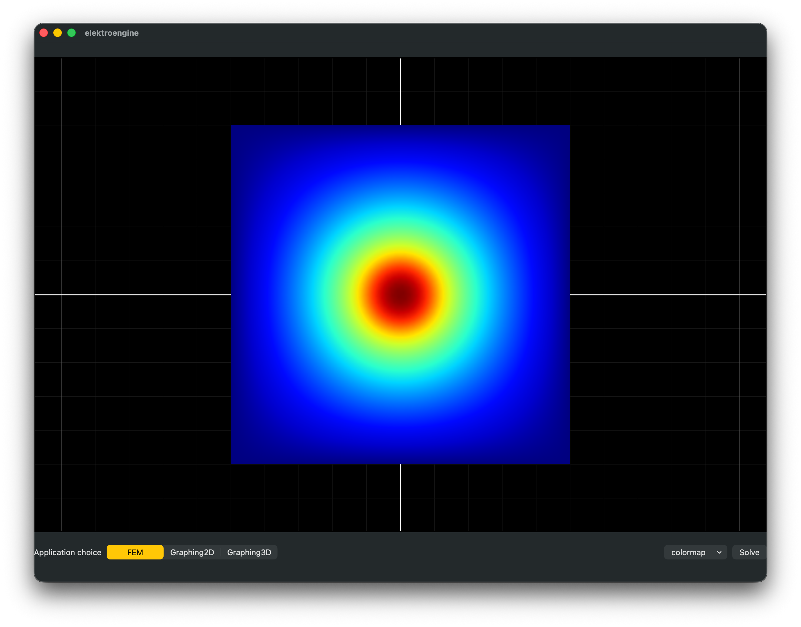
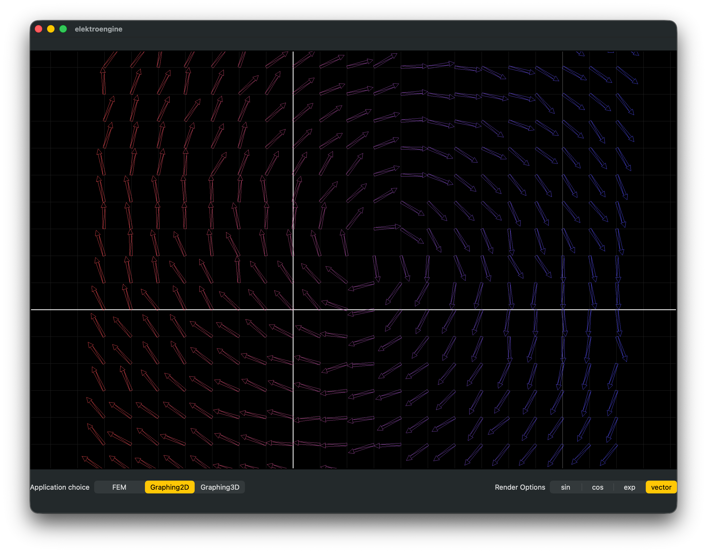
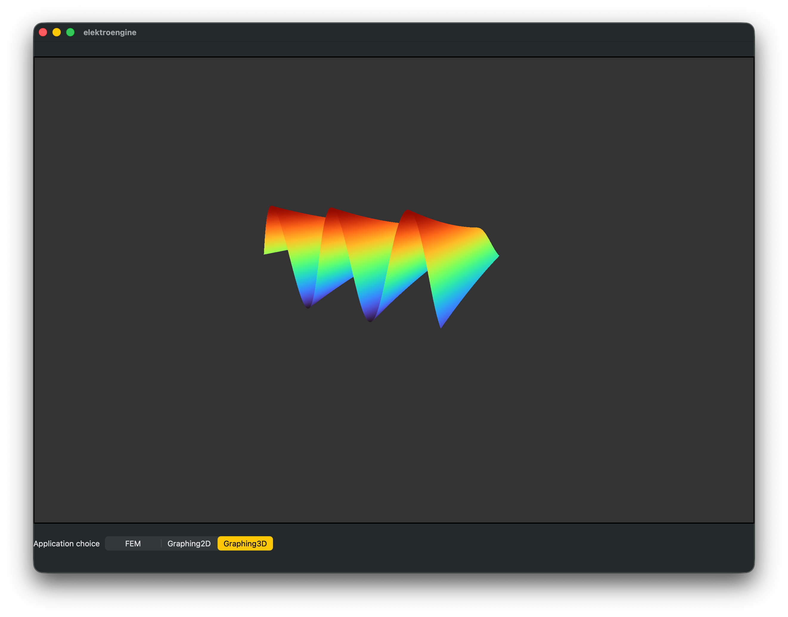

# ⚡ elektroengine

> A high-performance (???) graphics rendering engine, physics solver, and scientific visualizer — built in Swift, Metal, and C++.


<div align="center">
  
  &nbsp;&nbsp;&nbsp;&nbsp;
  &nbsp;&nbsp;&nbsp;&nbsp;
  &nbsp;&nbsp;&nbsp;&nbsp;
  
  &nbsp;&nbsp;&nbsp;&nbsp;
  &nbsp;&nbsp;&nbsp;&nbsp;
  &nbsp;&nbsp;&nbsp;&nbsp;
  
</div>

---

## Overview

**elektroengine** is a real-time scientific visualization and simulation tool powered by Apple's Metal GPU framework. It combines finite element analysis, 2D/3D graphing, and vector field rendering in a unified, tab-based interface.
---

## Screenshots


| FEM Solver | 2D Graphing | 3D Graphing |
|:---:|:---:|:---:|
|  |  |  |

---

## Features

### FEM — Finite Element Method Solver
WIP

### Graphing 2D
WIP

### Graphing 3D
WIP
---

## Tech Stack

| Layer | Technology |
|---|---|
| Language | Swift 5.9+ |
| GPU Rendering | Metal (MSL shaders) |
| Numerics / Solvers | Apple Accelerate |
| Meshing | gmsh C++ |
| UI Framework | SwiftUI |
| Platform | macOS / iOS |

---

## Getting Started

### Requirements

- Xcode 15+
- macOS 13 Ventura or later (or iOS 16+)
- A device with Metal support (most Apple silicon and Intel Macs)

### Build
WIP

---

## Project Structure
WIP
```
elektroengine/
```


---

## Roadmap

- [ ] Upgrade Metal 3 -> Metal 4
- [ ] Fluid simulation (Navier-Stokes on GPU)
- [ ] Electrostatic field solver
- [ ] Export to CSV / image / video
- [ ] Complex number / phase plotting in 2D
- [ ] Particle simulation

---

## Contributing

Pull requests are welcome. For major changes, please open an issue first to discuss what you'd like to change.


---

## License
WIP

---

<p align="center">Built with ⚡ Swift · Metal · C++</p>
